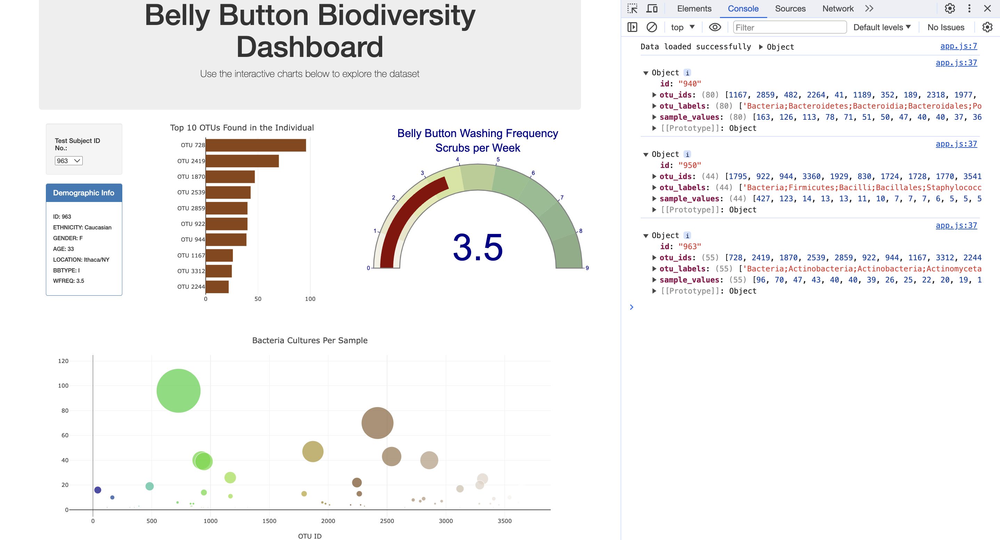

# Belly Button Biodiversity Dashboard

## Overview
This interactive dashboard explores the Belly Button Biodiversity dataset, which catalogs the microbes that colonize human navels. The dataset indicates that a few microbial species were present in more than 70% of people, while the rest were relatively rare. This project visualizes the microbial species (operational taxonomic units, or OTUs) found in individuals through interactive charts.

## Features
- A dropdown menu for selecting individual test subjects.
- A horizontal bar chart to display the top 10 OTUs found in the selected individual.
- A bubble chart to display the bacteria cultures per sample.
- A gauge chart to display the belly button washing frequency (scrubs per week) of the selected individual.
- Display of individual's demographic information.

## Technologies Used
- D3.js
- Plotly.js
- Bootstrap
- JavaScript
- HTML/CSS

## Interactive Visualizations
- **Bar Chart**: Initializes and updates dynamically based on the selected test subject.
- **Bubble Chart**: Displays each sample with OTU IDs, sample values, and labels.
- **Gauge Chart**: Indicates the weekly washing frequency of the individual.

## Deployment
The dashboard is hosted on GitHub Pages. You can access it [here](https://nidab-c.github.io/belly-button-challenge/).

## Dashboard Screenshot

## Usage
To use the dashboard, select a test subject ID number from the dropdown menu. The charts will automatically update to reflect the data associated with the selected ID.

## Data Source
The data was sourced from the Belly Button Biodiversity study by [Rob Dunn Lab](http://robdunnlab.com/projects/belly-button-biodiversity/results-and-data/).

## Local Setup
1. Clone the repository to your local machine.
2. Navigate to the project directory.
3. Open the `index.html` file in a web browser to view the dashboard locally.
4. Inspect the console for data structures as shown below:

